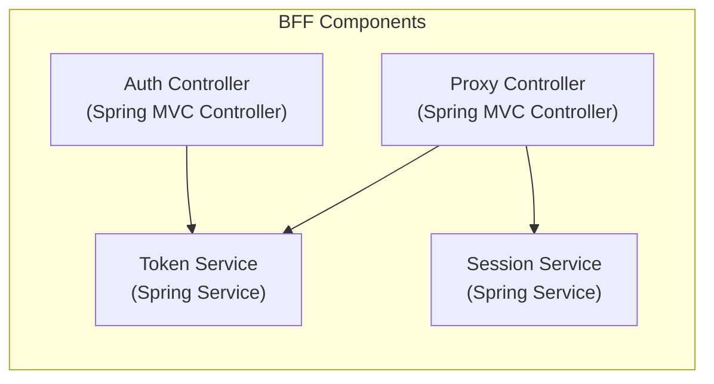
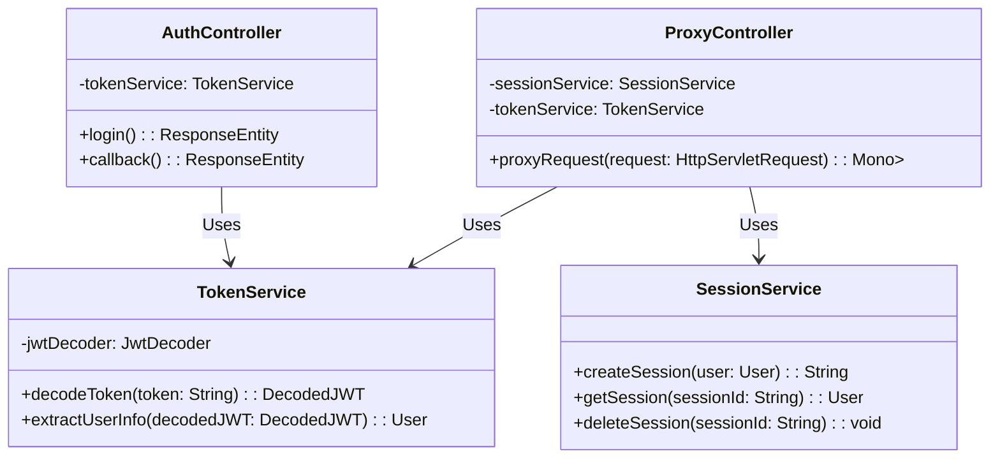

## The Proxy Controller in the BFF components of the 
provided architecture serves as an intermediary between the frontend (Vue.js application) and the backend (Spring Resource Server).

Here's a breakdown of its role:

- Receives API requests from the frontend: The Vue.js application, through its API client, sends requests to specific endpoints on the BFF. The Proxy Controller is responsible for handling these requests.
- Enforces authentication and authorization: Before forwarding requests to the Resource Server, the Proxy Controller likely interacts with the Session Service and Token Service to verify if the user is authenticated and authorized to access the requested resource.
- Forwards requests to the Resource Server: Once authentication and authorization are confirmed, the Proxy Controller forwards the request to the appropriate endpoint on the Resource Server. This might involve modifying headers, adding authentication tokens, or transforming the request data.
Receives responses from the Resource Server: After the Resource Server processes the request, it sends a response back to the Proxy Controller.
- Sends responses back to the frontend: The Proxy Controller receives the response from the Resource Server and sends it back to the Vue.js application. This might involve formatting the response data or handling errors.

In essence, the Proxy Controller acts as a secure gateway, ensuring that only authenticated and authorized requests reach the Resource Server while also abstracting the backend implementation details from the frontend.

## BFF Components:
- **`auth_controller` (Auth Controller):**
    - **Implementation**: Spring MVC Controller `(@RestController)`
    - **Why:** Handles authentication-related endpoints (e.g., /login, /callback) exposed to the Vue.js frontend. Spring MVC provides a robust framework for building RESTful web services.
- **`proxy_controller` (Proxy Controller):**
    - **Implementation**: Spring MVC Controller `(@RestController)` OR Spring Cloud Gateway
    - **Why:** Acts as a reverse proxy, forwarding requests to the Resource Server.
        - For simple proxying: Spring MVC Controllers can be used with annotations like @RequestMapping to map incoming requests to backend endpoints.
        - For more advanced routing, load balancing, or circuit breaking: Spring Cloud Gateway offers a dedicated solution.
- **`token_service` (Token Service):**
    - **Implementation**: Spring Service (@Service)
    - **Why:** Encapsulates logic for:
        - Validating JWT tokens received from the frontend (using Spring Security's JwtDecoder).
        - Extracting user information (claims) from valid tokens.
        - Potentially interacting with Keycloak for token introspection or refresh if needed.
- **`session_service` (Session Service):**
    - **Implementation**: Spring Service (@Service) + Spring Session
    - **Why:** Manages user sessions, potentially leveraging:
        - Spring Session with a distributed store (e.g., Redis) to ensure session persistence across multiple instances of the BFF.
        - Logic to create, retrieve, update, and delete session data associated with authenticated users.

### BFF components graph

### BFF Components Class DIagrams

**Key Spring Libraries and Modules:**

- **Spring Boot:** The foundation for building Spring applications, providing auto-configuration and simplifying dependency management.
- **Spring MVC:** For creating the RESTful web services exposed by the `auth_controller` and potentially the `proxy_controller`.
- **Spring Security:** Crucial for:
    - OAuth 2.0 client configuration to interact with Keycloak for authentication.
    - JWT token validation within the `token_service`.
    - Securing endpoints within the BFF if needed.
- Spring Session: Enables session management, especially important if you need to scale the BFF horizontally.
- Spring Cloud Gateway (Optional): A powerful option if your proxying needs go beyond basic forwarding (e.g., dynamic routing, load balancing).
- WebClient (For proxy_service): A reactive, non-blocking HTTP client provided by Spring WebFlux, suitable for making requests to the Resource Server.